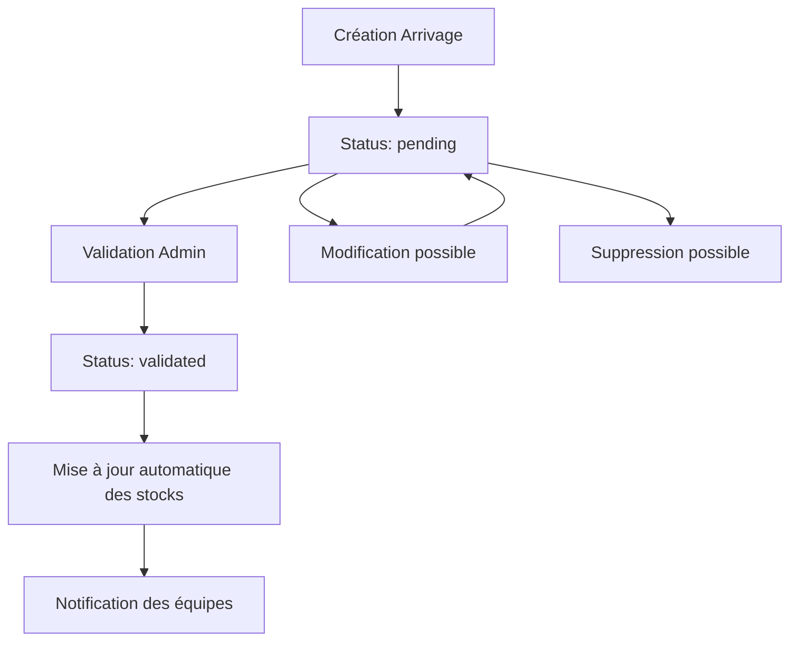

# 📦 Module Arrivages & 🔍 Recherche de Produits - Documentation Complète

## 🎯 Vue d'Ensemble

Cette documentation couvre deux modules interconnectés de l'API INTRAFMC :
- **Module Arrivages** : Gestion des livraisons et réapprovisionnements de produits CBD
- **Module Recherche** : Système de recherche avancée multi-critères pour les produits

---

## 📦 **MODULE ARRIVAGES**

### 📁 Structure du Module

```
app/Modules/Arrival/
├── GraphQL/
│   ├── Queries/
│   │   └── ArrivalQuery.php           # Récupération des arrivages
│   ├── Mutations/
│   │   └── ArrivalMutator.php         # CRUD des arrivages
│   └── schema.graphql                 # Schéma GraphQL
└── Services/
    └── ArrivalService.php             # Logique métier
```

### 🗄️ Modèles de Données

#### Table : `cbd_arrivals`

| Champ | Type | Description |
|-------|------|-------------|
| `id` | ID | Identifiant unique |
| `amount` | Decimal(8,2) | Montant total de l'arrivage |
| `status` | String | État : `pending`, `validated` |
| `created_at` | DateTime | Date de création |
| `updated_at` | DateTime | Date de modification |

#### Table : `arrival_product_cbd` (Pivot)

| Champ | Type | Description |
|-------|------|-------------|
| `id` | ID | Identifiant unique |
| `arrival_id` | ID | Référence vers l'arrivage |
| `product_id` | ID | Référence vers le produit |
| `quantity` | Integer | Quantité livrée |
| `unit_price` | Decimal(8,2) | Prix unitaire |

### 🔗 Relations

- **CbdArrival** `hasMany` **ArrivalProductCbd** → Produits de l'arrivage
- **ArrivalProductCbd** `belongsTo` **ProductCBD** → Produit concerné
- **ArrivalProductCbd** `belongsTo` **CbdArrival** → Arrivage parent

---

## 🔍 **API GRAPHQL - ARRIVAGES**

### 📖 Queries (Requêtes)

#### 1. **arrivals** - Liste paginée des arrivages
```graphql
query GetArrivals($first: Int, $page: Int) {
  arrivals(first: $first, page: $page) {
    data {
      id
      amount
      status
      products {
        id
        product_id
        quantity
        unit_price
        product {
          id
          name
          price
        }
      }
      created_at
      updated_at
    }
    paginatorInfo {
      currentPage
      hasMorePages
      total
      perPage
      lastPage
    }
  }
}
```

**Autorisations :** Admin uniquement (`@can(ability: "admin")`)

#### 2. **arrival** - Arrivage unique
```graphql
query GetArrival($arrival_id: ID!) {
  arrival(arrival_id: $arrival_id) {
    id
    amount
    status
    products {
      id
      product_id
      quantity
      unit_price
      product {
        id
        name
        description
        price
        stock
      }
    }
    created_at
    updated_at
  }
}
```

### ✏️ Mutations (Modifications)

#### 1. **createArrival** - Création d'un arrivage
```graphql
mutation CreateArrival($input: CreateArrivalInput!) {
  createArrival(input: $input) {
    id
    amount
    status
    products {
      id
      product_id
      quantity
      unit_price
    }
    created_at
  }
}

# Variables
{
  "input": {
    "amount": 1250.50,
    "status": "pending",
    "products": [
      {
        "product_id": 1,
        "quantity": 100,
        "unit_price": 10.50
      },
      {
        "product_id": 2,
        "quantity": 50,
        "unit_price": 15.00
      }
    ]
  }
}
```

#### 2. **validateArrival** - Validation et mise à jour des stocks
```graphql
mutation ValidateArrival($arrival_id: ID!) {
  validateArrival(arrival_id: $arrival_id) {
    id
    status
    products {
      product {
        id
        name
        stock  # Stock mis à jour automatiquement
      }
    }
  }
}
```

**⚡ Effet automatique :** La validation déclenche la mise à jour des stocks via l'événement `Model::updated()`.

#### 3. **updateArrival** - Modification d'un arrivage
```graphql
mutation UpdateArrival($arrival_id: ID!, $input: UpdateArrivalInput!) {
  updateArrival(arrival_id: $arrival_id, input: $input) {
    id
    amount
    status
    updated_at
  }
}
```

#### 4. **deleteArrival** - Suppression d'un arrivage
```graphql
mutation DeleteArrival($arrival_id: ID!) {
  deleteArrival(arrival_id: $arrival_id) {
    id
    status
  }
}
```

---

## 🔍 **MODULE RECHERCHE DE PRODUITS**

### 📁 Structure du Module

```
app/Modules/Product_CBD/GraphQL/Queries/
└── ProductSearchQuery.php             # Recherche avancée
```

### 🎯 Fonctionnalités de Recherche

#### 1. **searchProducts** - Recherche multi-critères
```graphql
query SearchProducts(
  $query: String
  $first: Int
  $page: Int
  $category_id: ID
  $min_price: Float
  $max_price: Float
  $in_stock: Boolean
) {
  searchProducts(
    query: $query
    first: $first
    page: $page
    category_id: $category_id
    min_price: $min_price
    max_price: $max_price
    in_stock: $in_stock
  ) {
    id
    name
    description
    price
    stock
    image_urls
    categories {
      id
      name
    }
  }
}
```

**Critères de recherche :**
- ✅ **Recherche textuelle** : Nom et description (`LIKE '%terme%'`)
- ✅ **Filtrage par catégorie** : Products liés à une catégorie
- ✅ **Plage de prix** : Prix minimum et maximum
- ✅ **Stock disponible** : Produits en stock uniquement
- ✅ **Tri intelligent** : Correspondance exacte → partielle → alphabétique

#### 2. **searchProductsByName** - Recherche rapide par nom
```graphql
query QuickSearch($name: String!, $limit: Int) {
  searchProductsByName(name: $name, limit: $limit) {
    id
    name
    price
    stock
    categories {
      name
    }
  }
}
```

#### 3. **productSuggestions** - Autocomplétion
```graphql
query GetSuggestions($query: String!) {
  productSuggestions(query: $query)
}

# Retourne : ["Huile CBD", "Huile Premium", "Huile Bio"]
```

---

## 🚀 **FONCTIONNALITÉS AVANCÉES**

### 🔄 Workflow des Arrivages



### 📊 Logique de Mise à Jour des Stocks

```php
// Automatique lors de la validation (Model::boot)
static::updated(function ($arrival) {
    if ($arrival->status === 'validated') {
        DB::transaction(function () use ($arrival) {
            foreach ($arrival->products as $arrivalProduct) {
                $product = $arrivalProduct->product;
                $product->stock += $arrivalProduct->quantity; // ← Addition au stock
                $product->save();
            }
        });
    }
});
```

### 🔍 Algorithme de Recherche Intelligent

```php
// Tri par pertinence dans ProductSearchQuery
$query->orderByRaw("
    CASE 
        WHEN name = ? THEN 1        -- Correspondance exacte
        WHEN name LIKE ? THEN 2     -- Commence par le terme
        ELSE 3                      -- Contient le terme
    END, name ASC, created_at DESC
", [$searchTerm, $searchTerm . '%']);
```

---

## 🔐 Sécurité et Autorisations

### **Arrivages**
- ✅ **Authentification** : Requise pour toutes les opérations
- ✅ **Autorisation Admin** : `@can(ability: "admin")` pour toutes les mutations
- ✅ **Gates Laravel** : Validation fine via `ArrivalPolicy`

### **Recherche**
- ✅ **Pas d'authentification** : Accessible publiquement
- ✅ **Limitation des résultats** : Protection contre les requêtes massives
- ✅ **Validation des entrées** : Filtrage des paramètres malveillants

---

## 💡 **EXEMPLES D'UTILISATION**

### 🎯 Cas d'Usage Frontend

#### **1. Dashboard Admin - Liste des Arrivages**
```vue
<template>
  <div class="arrivals-dashboard">
    <h2>Gestion des Arrivages</h2>
    
    <div v-for="arrival in arrivals" :key="arrival.id" class="arrival-card">
      <div class="header">
        <h3>Arrivage #{{ arrival.id }}</h3>
        <span :class="['status', arrival.status]">
          {{ arrival.status === 'pending' ? 'En attente' : 'Validé' }}
        </span>
      </div>
      
      <div class="details">
        <p><strong>Montant :</strong> {{ arrival.amount }}€</p>
        <p><strong>Produits :</strong> {{ arrival.products.length }} articles</p>
        <p><strong>Date :</strong> {{ formatDate(arrival.created_at) }}</p>
      </div>
      
      <div class="actions">
        <button 
          v-if="arrival.status === 'pending'" 
          @click="validateArrival(arrival.id)"
          class="btn-validate"
        >
          Valider l'arrivage
        </button>
        <button @click="viewDetails(arrival.id)" class="btn-details">
          Voir détails
        </button>
      </div>
    </div>
  </div>
</template>

<script setup lang="ts">
import { ref, onMounted } from 'vue'
import { useArrivalsStore } from '@/stores/arrivals'

const arrivalsStore = useArrivalsStore()
const arrivals = ref([])

onMounted(async () => {
  arrivals.value = await arrivalsStore.fetchArrivals()
})

const validateArrival = async (arrivalId: string) => {
  await arrivalsStore.validateArrival(arrivalId)
  arrivals.value = await arrivalsStore.fetchArrivals() // Refresh
}
</script>
```

#### **2. Recherche de Produits avec Filtres**
```vue
<template>
  <div class="product-search">
    <div class="search-filters">
      <input 
        v-model="searchQuery" 
        @input="search"
        placeholder="Rechercher des produits..."
        class="search-input"
      />
      
      <select v-model="filters.category_id" @change="search">
        <option value="">Toutes les catégories</option>
        <option v-for="cat in categories" :value="cat.id">
          {{ cat.name }}
        </option>
      </select>
      
      <div class="price-range">
        <input 
          v-model="filters.min_price" 
          @input="search"
          placeholder="Prix min"
          type="number"
        />
        <input 
          v-model="filters.max_price" 
          @input="search"
          placeholder="Prix max"
          type="number"
        />
      </div>
      
      <label>
        <input 
          v-model="filters.in_stock" 
          @change="search"
          type="checkbox"
        />
        En stock seulement
      </label>
    </div>
    
    <div class="search-results">
      <div v-for="product in products" :key="product.id" class="product-card">
        
        <h3>{{ product.name }}</h3>
        <p>{{ product.price }}€</p>
        <p>Stock: {{ product.stock }}</p>
        <div class="categories">
          <span v-for="cat in product.categories" :key="cat.id" class="tag">
            {{ cat.name }}
          </span>
        </div>
      </div>
    </div>
    
    <div v-if="!products.length && searchQuery" class="no-results">
      Aucun produit trouvé pour "{{ searchQuery }}"
    </div>
  </div>
</template>

<script setup lang="ts">
import { ref, reactive } from 'vue'
import { useProductsStore } from '@/stores/products'
import { debounce } from 'lodash'

const productsStore = useProductsStore()
const searchQuery = ref('')
const products = ref([])
const categories = ref([])

const filters = reactive({
  category_id: '',
  min_price: null,
  max_price: null,
  in_stock: false
})

const search = debounce(async () => {
  if (searchQuery.value.length >= 2 || Object.values(filters).some(v => v)) {
    products.value = await productsStore.searchProducts({
      query: searchQuery.value,
      ...filters
    })
  }
}, 300)
</script>
```

#### **3. Création d'Arrivage**
```vue
<template>
  <form @submit.prevent="createArrival" class="arrival-form">
    <h2>Nouvel Arrivage</h2>
    
    <div class="form-group">
      <label>Montant total</label>
      <input v-model="form.amount" type="number" step="0.01" required />
    </div>
    
    <div class="products-section">
      <h3>Produits</h3>
      <div v-for="(product, index) in form.products" :key="index" class="product-row">
        <select v-model="product.product_id" required>
          <option value="">Sélectionner un produit</option>
          <option v-for="p in availableProducts" :value="p.id">
            {{ p.name }} - {{ p.price }}€
          </option>
        </select>
        
        <input 
          v-model="product.quantity" 
          type="number" 
          placeholder="Quantité"
          min="1" 
          required 
        />
        
        <input 
          v-model="product.unit_price" 
          type="number" 
          step="0.01"
          placeholder="Prix unitaire"
          required 
        />
        
        <button type="button" @click="removeProduct(index)" class="btn-remove">
          Supprimer
        </button>
      </div>
      
      <button type="button" @click="addProduct" class="btn-add">
        Ajouter un produit
      </button>
    </div>
    
    <div class="form-actions">
      <button type="submit" :disabled="!isFormValid" class="btn-create">
        Créer l'arrivage
      </button>
    </div>
  </form>
</template>

<script setup lang="ts">
import { ref, computed, onMounted } from 'vue'
import { useArrivalsStore } from '@/stores/arrivals'
import { useProductsStore } from '@/stores/products'

const arrivalsStore = useArrivalsStore()
const productsStore = useProductsStore()

const form = ref({
  amount: 0,
  status: 'pending',
  products: [
    { product_id: '', quantity: 1, unit_price: 0 }
  ]
})

const availableProducts = ref([])

const isFormValid = computed(() => {
  return form.value.amount > 0 && 
         form.value.products.every(p => p.product_id && p.quantity > 0 && p.unit_price > 0)
})

onMounted(async () => {
  availableProducts.value = await productsStore.getAllProducts()
})

const addProduct = () => {
  form.value.products.push({ product_id: '', quantity: 1, unit_price: 0 })
}

const removeProduct = (index: number) => {
  form.value.products.splice(index, 1)
}

const createArrival = async () => {
  try {
    await arrivalsStore.createArrival(form.value)
    // Redirection ou notification de succès
  } catch (error) {
    console.error('Erreur création arrivage:', error)
  }
}
</script>
```

---

## 🎨 **STORES PINIA (Gestion d'État)**

### **ArrivalsStore**
```typescript
// stores/arrivals.ts
import { defineStore } from 'pinia'
import { arrivalService } from '@/services/arrivalService'

export const useArrivalsStore = defineStore('arrivals', {
  state: () => ({
    arrivals: [],
    currentArrival: null,
    loading: false,
    pagination: {
      currentPage: 1,
      total: 0,
      perPage: 15
    }
  }),

  actions: {
    async fetchArrivals(page = 1) {
      this.loading = true
      try {
        const response = await arrivalService.getArrivals(page)
        this.arrivals = response.data
        this.pagination = response.paginatorInfo
        return response.data
      } finally {
        this.loading = false
      }
    },

    async createArrival(arrivalData) {
      const response = await arrivalService.createArrival(arrivalData)
      this.arrivals.unshift(response)
      return response
    },

    async validateArrival(arrivalId: string) {
      const response = await arrivalService.validateArrival(arrivalId)
      const index = this.arrivals.findIndex(a => a.id === arrivalId)
      if (index !== -1) {
        this.arrivals[index] = response
      }
      return response
    },

    async deleteArrival(arrivalId: string) {
      await arrivalService.deleteArrival(arrivalId)
      this.arrivals = this.arrivals.filter(a => a.id !== arrivalId)
    }
  }
})
```

### **ProductSearchStore**
```typescript
// stores/productSearch.ts
import { defineStore } from 'pinia'
import { productService } from '@/services/productService'

export const useProductSearchStore = defineStore('productSearch', {
  state: () => ({
    searchResults: [],
    suggestions: [],
    loading: false,
    lastQuery: '',
    filters: {
      category_id: '',
      min_price: null,
      max_price: null,
      in_stock: false
    }
  }),

  actions: {
    async searchProducts(query: string, filters = {}) {
      this.loading = true
      this.lastQuery = query
      
      try {
        const response = await productService.searchProducts({
          query,
          ...this.filters,
          ...filters
        })
        
        this.searchResults = response
        return response
      } finally {
        this.loading = false
      }
    },

    async getSuggestions(query: string) {
      if (query.length < 2) {
        this.suggestions = []
        return []
      }

      const response = await productService.getProductSuggestions(query)
      this.suggestions = response
      return response
    },

    updateFilters(newFilters) {
      this.filters = { ...this.filters, ...newFilters }
    },

    clearSearch() {
      this.searchResults = []
      this.lastQuery = ''
      this.suggestions = []
    }
  }
})
```

---

## 🧪 **TESTS AUTOMATISÉS**

### **Tests d'Arrivages**
```php
// tests/Feature/ArrivalTest.php
class ArrivalTest extends TestCase
{
    /** @test */
    public function admin_can_create_arrival()
    {
        $admin = User::factory()->create(['is_admin' => true]);
        $products = ProductCBD::factory(2)->create();

        $response = $this->actingAs($admin)->graphQL('
            mutation CreateArrival($input: CreateArrivalInput!) {
                createArrival(input: $input) {
                    id
                    amount
                    status
                    products {
                        product_id
                        quantity
                    }
                }
            }
        ', [
            'input' => [
                'amount' => 500.00,
                'status' => 'pending',
                'products' => [
                    [
                        'product_id' => $products[0]->id,
                        'quantity' => 10,
                        'unit_price' => 25.00
                    ]
                ]
            ]
        ]);

        $response->assertJson([
            'data' => [
                'createArrival' => [
                    'amount' => 500.00,
                    'status' => 'pending'
                ]
            ]
        ]);
    }

    /** @test */
    public function validating_arrival_updates_product_stock()
    {
        $admin = User::factory()->create(['is_admin' => true]);
        $product = ProductCBD::factory()->create(['stock' => 50]);
        
        $arrival = CbdArrival::factory()->create(['status' => 'pending']);
        ArrivalProductCbd::factory()->create([
            'arrival_id' => $arrival->id,
            'product_id' => $product->id,
            'quantity' => 20
        ]);

        $this->actingAs($admin)->graphQL('
            mutation ValidateArrival($arrival_id: ID!) {
                validateArrival(arrival_id: $arrival_id) {
                    id
                    status
                }
            }
        ', ['arrival_id' => $arrival->id]);

        $product->refresh();
        $this->assertEquals(70, $product->stock); // 50 + 20
    }
}
```

### **Tests de Recherche**
```php
// tests/Feature/ProductSearchTest.php
class ProductSearchTest extends TestCase
{
    /** @test */
    public function can_search_products_by_name()
    {
        ProductCBD::factory()->create(['name' => 'Huile CBD Premium']);
        ProductCBD::factory()->create(['name' => 'Capsules CBD']);
        ProductCBD::factory()->create(['name' => 'Crème au CBD']);

        $response = $this->graphQL('
            query SearchProducts($query: String!) {
                searchProducts(query: $query) {
                    id
                    name
                }
            }
        ', ['query' => 'CBD']);

        $response->assertJsonCount(3, 'data.searchProducts');
    }

    /** @test */
    public function search_returns_exact_matches_first()
    {
        $exact = ProductCBD::factory()->create(['name' => 'CBD']);
        $partial = ProductCBD::factory()->create(['name' => 'CBD Premium']);

        $response = $this->graphQL('
            query SearchProducts($query: String!) {
                searchProducts(query: $query) {
                    id
                    name
                }
            }
        ', ['query' => 'CBD']);

        $results = $response->json('data.searchProducts');
        $this->assertEquals($exact->id, $results[0]['id']);
    }
}
```

---

## 📊 **MÉTRIQUES ET MONITORING**

### **KPIs Arrivages**
- **Temps de validation** : Délai entre création et validation
- **Valeur moyenne** : Montant moyen des arrivages
- **Fréquence** : Nombre d'arrivages par mois
- **Produits les plus livrés** : Top 10 des produits

### **KPIs Recherche**
- **Requêtes par jour** : Volume de recherches
- **Termes populaires** : Mots-clés les plus recherchés
- **Taux de résultats vides** : Recherches sans résultats
- **Performance** : Temps de réponse moyen

### **Logs Recommandés**
```php
// Dans ArrivalService
Log::info('Arrivage créé', [
    'arrival_id' => $arrival->id,
    'amount' => $arrival->amount,
    'products_count' => count($data['products']),
    'user_id' => auth()->id()
]);

// Dans ProductSearchQuery
Log::info('Recherche produit', [
    'query' => $args['query'] ?? '',
    'filters' => array_filter($args),
    'results_count' => $query->count(),
    'response_time' => microtime(true) - $startTime
]);
```

---

## 🚀 **ÉVOLUTIONS FUTURES**

### **Arrivages v2.0**
- [ ] **Scan de codes-barres** pour ajout rapide de produits
- [ ] **Notifications push** lors de nouvelles livraisons
- [ ] **Workflow d'approbation** multi-niveaux
- [ ] **Intégration fournisseurs** avec API externes
- [ ] **Prédictions de stock** basées sur l'historique

### **Recherche v2.0**
- [ ] **Elasticsearch** pour recherche full-text avancée
- [ ] **Recherche visuelle** par upload d'image
- [ ] **Recommandations IA** basées sur l'historique
- [ ] **Recherche vocale** via Web Speech API
- [ ] **Filtres géographiques** par disponibilité

### **Analytics v2.0**
- [ ] **Dashboard temps réel** avec WebSockets
- [ ] **Machine Learning** pour optimisation des stocks
- [ ] **Rapports automatisés** par email
- [ ] **API mobile** dédiée
- [ ] **Export avancé** (Excel, PDF, CSV)

---

## 📞 **Support et Maintenance**

**Modules :** Arrivages & Recherche de Produits  
**Version :** 1.0.0  
**Dernière mise à jour :** Septembre 2025

**Responsabilités :**
- **Backend :** Équipe API INTRAFMC
- **Frontend :** Équipe Vue.js
- **DevOps :** Équipe Infrastructure

**Documentation technique :** 
- `ARCHITECTURE.md` - Architecture générale
- `MODULE_PRODUCT_CBD.md` - Module produits
- `API_DOCUMENTATION.md` - Documentation API complète

---

*Cette documentation est maintenue et mise à jour régulièrement. Pour des questions spécifiques ou des demandes d'évolution, utiliser les issues GitHub avec les labels appropriés.*
