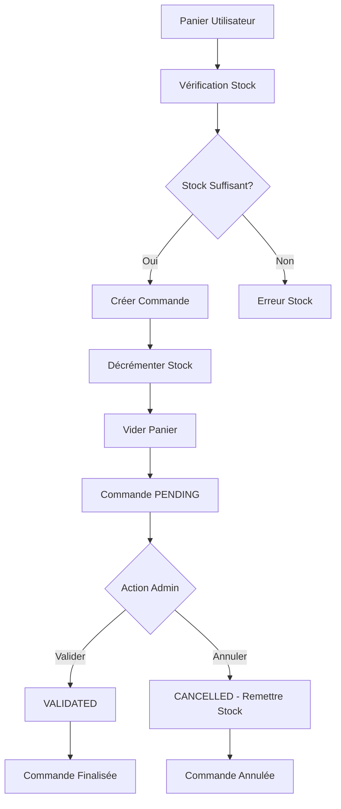

# 📦 MODULE ORDER - Documentation Complète

## 📋 Vue d'ensemble

Le module Order gère l'ensemble du cycle de vie des commandes dans l'API INTRAFMC, de la création à partir du panier jusqu'à la livraison, en passant par la validation et le suivi des statuts.

## 🏗️ Architecture du Module

```
app/Modules/Order/
├── GraphQL/
│   ├── Mutations/
│   │   └── OrderMutator.php         # Mutations GraphQL (checkout, cancel, update status)
│   ├── Queries/
│   │   ├── OrderQuery.php           # Requêtes GraphQL principales
│   │   ├── OrderStatisticsQuery.php # Statistiques avancées
│   │   └── OrderStatisticsQuery_Simple.php # Statistiques simples
│   ├── Resolvers/
│   │   └── OrderProductPivotResolver.php # Résolveur pour les données pivot
│   └── schema.graphql               # Schéma GraphQL
└── Services/
    └── OrderService.php             # Logique métier centrale
```

## 🎯 Fonctionnalités Principales

### ✅ Gestion des Commandes
- **Création** : Transformation automatique du panier en commande
- **Validation** : Vérification du stock et création sécurisée
- **Annulation** : Remise en stock automatique
- **Suivi** : Gestion des statuts avec transitions contrôlées

### 📊 Statistiques
- Statistiques par commande
- Analyses globales des ventes
- Rapports utilisateur

### 🔐 Sécurité
- Authentification obligatoire
- Autorisations par rôle (admin/utilisateur)
- Vérification de propriété des commandes

## 🔗 API GraphQL

### 📖 Queries

#### Lister toutes les commandes (Admin)
```graphql
query GetAllOrders {
  orders {
    id
    total
    status
    created_at
    user {
      id
      name
      email
    }
    products {
      id
      name
      price
      pivot {
        quantity
        unit_price
      }
    }
  }
}
```

#### Mes commandes (Utilisateur connecté)
```graphql
query GetMyOrders {
  myOrders {
    id
    total
    status
    formatted_status
    total_items
    product_count
    created_at
    products {
      id
      name
      price
      images
      pivot {
        quantity
        unit_price
      }
    }
  }
}
```

#### Détails d'une commande
```graphql
query GetOrderDetails($id: ID!) {
  orderDetails(id: $id) {
    id
    total
    status
    formatted_status
    created_at
    updated_at
    user {
      id
      name
      email
    }
    products {
      id
      name
      price
      images
      categories {
        id
        name
      }
      pivot {
        quantity
        unit_price
      }
    }
    total_items
    product_count
  }
}
```

#### Statistiques d'une commande
```graphql
query GetOrderStats($id: ID!) {
  orderStats(id: $id) {
    order_id
    total_items
    product_count
    total_amount
    average_item_price
    created_at
    status
    formatted_status
  }
}
```

### ✏️ Mutations

#### Créer une commande (Checkout)
```graphql
mutation Checkout {
  checkout {
    id
    total
    status
    formatted_status
    created_at
    user {
      id
      name
    }
    products {
      id
      name
      price
      pivot {
        quantity
        unit_price
      }
    }
    total_items
    product_count
  }
}
```

#### Annuler une commande
```graphql
mutation CancelOrder($id: ID!) {
  cancelOrder(id: $id)
}
```

#### Mettre à jour le statut (Admin)
```graphql
mutation UpdateOrderStatus($input: UpdateOrderStatusInput!) {
  updateOrderStatus(input: $input) {
    id
    status
    formatted_status
    user {
      id
      name
    }
    products {
      id
      name
      pivot {
        quantity
        unit_price
      }
    }
  }
}

# Variables:
{
  "input": {
    "id": "1",
    "status": "validated"
  }
}
```

## 🏷️ Types GraphQL

### Type Order
```graphql
type Order {
  id: ID!
  user_id: Int!
  user: User!
  total: Float!
  status: String!
  created_at: DateTime
  updated_at: DateTime
  
  # Relations avec les produits
  products: [ProductCBD!]!
  orderProducts: [OrderProduct!]!
  
  # Accesseurs calculés
  total_items: Int!
  product_count: Int!
  formatted_status: String!
}
```

### Type OrderProduct
```graphql
type OrderProduct {
  id: ID!
  order_id: Int!
  product_id: Int!
  quantity: Int!
  unit_price: Float!
  created_at: DateTime
  updated_at: DateTime
  
  # Relations
  order: Order
  product: ProductCBD
}
```

### Type OrderStats
```graphql
type OrderStats {
  order_id: ID!
  total_items: Int!
  product_count: Int!
  total_amount: Float!
  average_item_price: Float!
  created_at: DateTime!
  status: String!
  formatted_status: String!
}
```

## ⚙️ Service Layer - OrderService

### Méthodes Principales

#### `checkout($userId)`
Crée une commande à partir du panier utilisateur :
- ✅ Vérification du panier non vide
- ✅ Contrôle du stock disponible
- ✅ Calcul du total automatique
- ✅ Création transactionnelle
- ✅ Décrément du stock
- ✅ Vidage du panier
- ✅ Logging complet

```php
// Exemple d'utilisation
$orderService = new OrderService();
$order = $orderService->checkout($userId);
```

#### `cancelOrder($orderId, $userId = null)`
Annule une commande existante :
- ✅ Vérification du statut (impossible si expédiée/livrée)
- ✅ Remise en stock automatique
- ✅ Mise à jour du statut
- ✅ Logging de l'annulation

#### `updateOrderStatus($orderId, $newStatus)`
Met à jour le statut d'une commande :
- ✅ Validation des statuts (`pending`, `validated`, `cancelled`)
- ✅ Contrôle des transitions autorisées
- ✅ Logging des changements

### Gestion des Statuts

```php
// Statuts valides (ENUM en BDD)
$validStatuses = ['pending', 'validated', 'cancelled'];

// Transitions autorisées
$validTransitions = [
    'pending' => ['validated', 'cancelled'],
    'validated' => [], // État final
    'cancelled' => [], // État final
];
```

## 🔒 Sécurité et Autorisations

### Policies Appliquées

```php
// OrderPolicy (implicite via Gate)
- create: Utilisateurs authentifiés
- view: Propriétaire ou Admin
- update: Admin uniquement
- delete: Propriétaire ou Admin
```

### Contrôles d'Accès

```php
// Vérifications dans OrderQuery
if (!Gate::allows('viewAny', Order::class)) {
    return Order::query()->whereRaw('1=0'); // Résultat vide
}

// Limitation aux commandes personnelles pour les non-admins
if (!$user->is_admin) {
    $query->where('user_id', $user->id);
}
```

## 🗄️ Modèle de Données

### Table `orders`
```sql
CREATE TABLE orders (
    id BIGINT PRIMARY KEY AUTO_INCREMENT,
    user_id BIGINT NOT NULL,
    total DECIMAL(10,2) NOT NULL,
    status ENUM('pending', 'validated', 'cancelled') DEFAULT 'pending',
    created_at TIMESTAMP,
    updated_at TIMESTAMP,
    
    FOREIGN KEY (user_id) REFERENCES users(id)
);
```

### Table `order_product` (Pivot)
```sql
CREATE TABLE order_product (
    id BIGINT PRIMARY KEY AUTO_INCREMENT,
    order_id BIGINT NOT NULL,
    product_id BIGINT NOT NULL,
    quantity INT NOT NULL,
    unit_price DECIMAL(10,2) NOT NULL,
    created_at TIMESTAMP,
    updated_at TIMESTAMP,
    
    FOREIGN KEY (order_id) REFERENCES orders(id),
    FOREIGN KEY (product_id) REFERENCES cbd_products(id)
);
```

### Relations Eloquent

```php
// Order.php
public function products(): BelongsToMany {
    return $this->belongsToMany(ProductCBD::class, 'order_product')
        ->withPivot('quantity', 'unit_price')
        ->withTimestamps();
}

public function user(): BelongsTo {
    return $this->belongsTo(User::class);
}

// Accesseurs calculés
public function getTotalItemsAttribute(): int {
    return $this->products->sum('pivot.quantity');
}

public function getProductCountAttribute(): int {
    return $this->products->count();
}
```

## 🎮 Exemples d'Utilisation Frontend

### Processus de Commande Complet

```javascript
// 1. Vérifier le panier avant checkout
const cartQuery = `
  query GetMyCart {
    myCart {
      id
      quantity
      product {
        id
        name
        price
        stock
      }
    }
  }
`;

// 2. Procéder au checkout
const checkoutMutation = `
  mutation Checkout {
    checkout {
      id
      total
      status
      formatted_status
      total_items
      product_count
      created_at
      products {
        id
        name
        price
        pivot {
          quantity
          unit_price
        }
      }
    }
  }
`;

// 3. Gérer la réponse
const handleCheckout = async () => {
  try {
    const result = await apolloClient.mutate({
      mutation: CHECKOUT_MUTATION
    });
    
    const order = result.data.checkout;
    console.log(`Commande ${order.id} créée avec succès !`);
    console.log(`Total: ${order.total}€`);
    console.log(`Statut: ${order.formatted_status}`);
    
    // Redirection vers la page de confirmation
    router.push(`/orders/${order.id}`);
    
  } catch (error) {
    if (error.extensions?.category === 'validation') {
      alert('Panier vide ou stock insuffisant');
    } else {
      alert('Erreur lors de la création de la commande');
    }
  }
};
```

### Suivi des Commandes

```javascript
// Liste des commandes utilisateur
const MyOrdersComponent = {
  data() {
    return {
      orders: []
    };
  },
  
  apollo: {
    orders: {
      query: gql`
        query GetMyOrders {
          myOrders {
            id
            total
            status
            formatted_status
            total_items
            product_count
            created_at
            products {
              id
              name
              price
              images
              pivot {
                quantity
                unit_price
              }
            }
          }
        }
      `,
      error(error) {
        console.error('Erreur chargement commandes:', error);
      }
    }
  },
  
  methods: {
    async cancelOrder(orderId) {
      try {
        await this.$apollo.mutate({
          mutation: gql`
            mutation CancelOrder($id: ID!) {
              cancelOrder(id: $id)
            }
          `,
          variables: { id: orderId }
        });
        
        // Actualiser la liste
        this.$apollo.queries.orders.refetch();
        this.$toast.success('Commande annulée avec succès');
        
      } catch (error) {
        this.$toast.error('Impossible d\'annuler la commande');
      }
    }
  }
};
```

### Interface Admin

```javascript
// Gestion admin des commandes
const AdminOrdersComponent = {
  data() {
    return {
      orders: [],
      selectedStatus: 'all'
    };
  },
  
  apollo: {
    orders: {
      query: gql`
        query GetAllOrders {
          orders {
            id
            total
            status
            formatted_status
            created_at
            user {
              id
              name
              email
            }
            total_items
            product_count
          }
        }
      `
    }
  },
  
  methods: {
    async updateOrderStatus(orderId, newStatus) {
      try {
        await this.$apollo.mutate({
          mutation: gql`
            mutation UpdateOrderStatus($input: UpdateOrderStatusInput!) {
              updateOrderStatus(input: $input) {
                id
                status
                formatted_status
              }
            }
          `,
          variables: {
            input: {
              id: orderId,
              status: newStatus
            }
          }
        });
        
        this.$apollo.queries.orders.refetch();
        this.$toast.success('Statut mis à jour');
        
      } catch (error) {
        this.$toast.error('Erreur mise à jour statut');
      }
    }
  }
};
```

## 🏪 Store Pinia

```javascript
// stores/orders.js
import { defineStore } from 'pinia';
import { apolloClient } from '@/apollo';
import { 
  GET_MY_ORDERS, 
  CHECKOUT_MUTATION, 
  CANCEL_ORDER_MUTATION 
} from '@/graphql/orders';

export const useOrdersStore = defineStore('orders', {
  state: () => ({
    orders: [],
    currentOrder: null,
    loading: false,
    error: null
  }),

  getters: {
    pendingOrders: (state) => 
      state.orders.filter(order => order.status === 'pending'),
    
    validatedOrders: (state) => 
      state.orders.filter(order => order.status === 'validated'),
    
    totalSpent: (state) => 
      state.orders
        .filter(order => order.status === 'validated')
        .reduce((sum, order) => sum + order.total, 0)
  },

  actions: {
    async fetchMyOrders() {
      this.loading = true;
      try {
        const { data } = await apolloClient.query({
          query: GET_MY_ORDERS,
          fetchPolicy: 'network-only'
        });
        this.orders = data.myOrders;
      } catch (error) {
        this.error = error;
        throw error;
      } finally {
        this.loading = false;
      }
    },

    async checkout() {
      this.loading = true;
      try {
        const { data } = await apolloClient.mutate({
          mutation: CHECKOUT_MUTATION
        });
        
        const newOrder = data.checkout;
        this.orders.unshift(newOrder);
        this.currentOrder = newOrder;
        
        return newOrder;
      } catch (error) {
        this.error = error;
        throw error;
      } finally {
        this.loading = false;
      }
    },

    async cancelOrder(orderId) {
      try {
        await apolloClient.mutate({
          mutation: CANCEL_ORDER_MUTATION,
          variables: { id: orderId }
        });
        
        // Mettre à jour localement
        const order = this.orders.find(o => o.id === orderId);
        if (order) {
          order.status = 'cancelled';
          order.formatted_status = 'Annulée';
        }
      } catch (error) {
        this.error = error;
        throw error;
      }
    }
  }
});
```

## 🧪 Tests

### Tests Unitaires
```bash
# Lancer les tests du module Order
php vendor/bin/phpunit --filter OrderTest
php vendor/bin/phpunit --filter OrderStatisticsTest
```

### Tests d'Intégration GraphQL
```php
// tests/Feature/GraphQL/OrderTest.php
public function test_checkout_creates_order_from_cart()
{
    // Arrange: Créer utilisateur et panier
    $user = User::factory()->create();
    $product = ProductCBD::factory()->create(['stock' => 10]);
    Cart::create([
        'user_id' => $user->id,
        'product_id' => $product->id,
        'quantity' => 2
    ]);

    // Act: Effectuer le checkout
    $response = $this->actingAs($user)->graphQL('
        mutation {
            checkout {
                id
                total
                status
                total_items
                products {
                    id
                    pivot {
                        quantity
                    }
                }
            }
        }
    ');

    // Assert: Vérifier la commande créée
    $response->assertJson([
        'data' => [
            'checkout' => [
                'total' => $product->price * 2,
                'status' => 'pending',
                'total_items' => 2
            ]
        ]
    ]);
}
```

## 📊 Métriques et Monitoring

### KPIs Suivis
- **Taux de conversion** : Paniers → Commandes
- **Panier moyen** : Valeur moyenne des commandes
- **Taux d'annulation** : Commandes annulées / Total
- **Délai de traitement** : Temps pending → validated

### Logs Structurés
```php
// Logs dans OrderService
Log::info('Commande créée avec succès', [
    'order_id' => $order->id,
    'user_id' => $userId,
    'total' => $total,
    'items_count' => count($orderItems)
]);

Log::info('Statut de commande mis à jour', [
    'order_id' => $orderId,
    'old_status' => $oldStatus,
    'new_status' => $newStatus
]);
```

## 🚀 Optimisations

### Performance
- **Eager Loading** : Relations chargées en une requête
- **Pagination** : Limite par défaut de 15 commandes
- **Index BDD** : Sur user_id, status, created_at

### Cache
```php
// Cache des statistiques (potentiel)
Cache::remember("user_orders_stats_{$userId}", 3600, function() {
    return $this->getOrderStats(['user_id' => $userId]);
});
```

## 🔧 Configuration

### Variables d'Environnement
```env
# Pas de configuration spécifique requise
# Utilise les settings Laravel standards
```

### Lighthouse Schema
```php
// config/lighthouse.php
'namespaces' => [
    'mutations' => [
        'App\\Modules\\Order\\GraphQL\\Mutations',
    ],
    'queries' => [
        'App\\Modules\\Order\\GraphQL\\Queries',
    ],
]
```

## 🔄 Workflow de Commande



## 📋 Checklist Déploiement

- ✅ Migration des tables orders et order_product
- ✅ Seeding des données de test
- ✅ Configuration des permissions
- ✅ Tests de régression
- ✅ Validation des queries GraphQL
- ✅ Test du workflow complet
- ✅ Monitoring des performances

---

**Dernière mise à jour** : Septembre 2025  
**Version API** : v1.0  
**Compatibilité** : Laravel 11, Lighthouse 6, GraphQL
